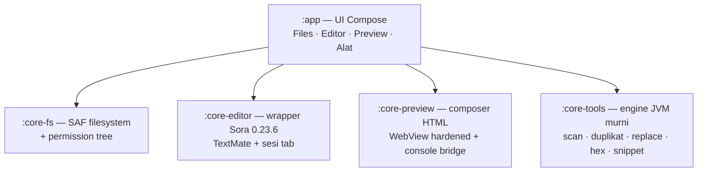
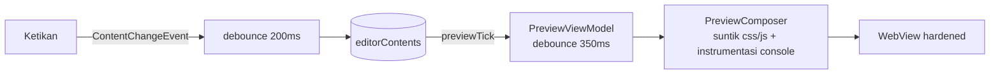

<div align="center">

# zaaam/editors

**Ngoding langsung dari HP — editor kode + file manager + live preview + kotak alat, 100% offline.**

[](https://github.com/az925-crypto/Editors/actions/workflows/ci.yml)
[](https://github.com/az925-crypto/Editors/releases)


*Buka folder via SAF → edit dengan syntax highlighting → lihat hasilnya hidup di preview → bereskan proyekmu dengan lima perkakas bawaan.*

</div>

---

## 📖 Daftar Isi

| | Seksi | Buat kamu yang... |
|---|---|---|
| 🚀 | [Mulai dalam 60 detik](#-mulai-dalam-60-detik) | baru install & mau langsung pakai |
| 🧭 | [Tur Fitur](#-tur-fitur) | ingin tahu apa saja isinya |
| 🛠️ | [Resep Tugas Umum](#️-resep-tugas-umum) | butuh cara melakukan sesuatu |
| 🏗️ | [Arsitektur](#️-arsitektur) | pengintip kode / kontributor |
| 🔒 | [Keamanan & Privasi](#-keamanan--privasi) | peduli data aman |
| ❓ | [FAQ & Troubleshooting](#-faq--troubleshooting) | menemui masalah |
| 📚 | [Dokumentasi Dalam](#-dokumentasi-dalam) | mau mendalami proyek |

---

## ✨ Kenapa editors?

> **Dibuat untuk developer yang ngoding dari HP.** Bukan port IDE desktop, bukan viewer biasa — dirancang dari awal untuk layar sentuh, jalan penuh tanpa internet, tanpa akun, tanpa telemetri.

| ⚡ Live Preview | 🎨 Syntax Highlighting | 🧰 5 Alat Bawaan |
|---|---|---|
| Editor & hasil render **tampil bersamaan**, update otomatis saat kamu berhenti mengetik (~½ detik). Console `log/warn/error` ikut tertangkap. | Sora Editor + grammar TextMate: HTML, CSS, JS, Kotlin, Python, JSON — plus autosave otomatis dengan LED status jujur. | Analisa penyimpanan, cari duplikat, ganti massal lintas file, editor heksa, dan snippet — semuanya offline. |

Estetika **"Zaurus di Meja Kerja"**: plastik bone + graphite + LCD olive ala gadget retro Jepang, skeuomorphism selektif (bevel, sekrup, LED) tanpa blur.

---

## 🚀 Mulai dalam 60 detik

1. **Install** APK terbaru dari [Releases](https://github.com/az925-crypto/Editors/releases) → `zaaam-editors-x.y.z.apk`
2. **Buka app** → dialog sistem muncul → **pilih folder** project-mu dan grant izin baca+tulis *(sekali saja per folder; app mengingatnya)*
3. **Tap file** di tab Files:
   - file teks (`html`, `css`, `js`, `kt`, ...) → terbuka di **Editor**
   - file biner (`jpg`, `zip`, `apk`, ...) → langsung masuk **Editor Heks**
4. **Ngoding** — highlighting aktif otomatis; autosave berjalan sendiri (LED di bawah tab berkedip *Menyimpan…* → *Tersimpan*)
5. File web? Tap chip **`Split ◫`** di Editor → pratinjau live muncul berdampingan, atau chip **`Preview ▶`** untuk mode layar penuh + console

> 💡 **Tips:** buka `index.html` + `style.css` + `main.js` bersamaan sebagai tab — preview otomatis menyuntikkan keduanya ke halaman.

---

## 🧭 Tur Fitur

### 📂 Files
Browse folder via Android SAF. Breadcrumb navigasi, file terbaru diingat, banner error yang jujur. Tap biner = pintasan ke hex editor.

### ✍️ Editor
Multi-tab dengan titik oranye penanda belum tersimpan, syntax highlighting TextMate, autosave anti-korupsi (~900ms setelah berhenti mengetik), dan:

- **`Split ◫`** — live preview berdampingan (portrait: atas-bawah, landscape: samping-samping). Pilihan tersimpan antar sesi.
- **`Preview ▶`** — lompat ke layar Preview penuh.

### 👁️ Preview + Console
Render WebView yang di-hardening penuh. Console drawer menangkap `console.log/warn/error` **dan** error runtime halaman (maks 30 pesan/detik, riwayat 200 entri). Tombol ↻ memuat ulang paksa.

### 🧰 Alat (semua berbagi satu pindaian folder)

| Alat | Fungsi | Batas Aman |
|---|---|---|
| 📊 Analisa Penyimpanan | Folder/file terbesar + readout total | — |
| 🔍 Cari Duplikat | SHA-1 bertahap, grup per hash | Tanpa tombol hapus (by design — lihat dulu, buka salinannya di editor) |
| ✴️ Ganti Massal | Cari-ganti literal lintas file | Review highlight → konfirmasi destruktif → tiap file diverifikasi ulang sebelum ditulis |
| 🧮 Editor Heks | Intip/edit byte file biner | Maks 16 MB/file, undo 32 langkah |
| 📋 Snippet | Simpan potongan kode | Ekspor/impor JSON skema `zaaam-snippets` v1 |

---

## 🛠️ Resep Tugas Umum

<details>
<summary><b>📦 Build debug / rilis versi baru</b></summary>

Build & test **hanya via GitHub Actions CI** (repo ini dikembangkan dari Termux — tidak ada SDK lokal):

```bash
git push origin main                # CI jalan: assembleDebug + unit test + lint
gh run list --limit 1               # cek status
gh run view <id> --log-failed       # kalau gagal, lihat errornya

# Rilis versi baru:
# 1. bump versionCode/versionName di app/build.gradle.kts
# 2. commit + push, tunggu CI hijau
git tag vX.Y.Z && git push origin vX.Y.Z   # Release workflow upload APK otomatis
```
</details>

<details>
<summary><b>🔎 Pintasan harian</b></summary>

| Kamu mau... | Jalannya |
|---|---|
| Cari file/folder terbesar | Alat → **Analisa Penyimpanan** → pindai |
| Bereskan duplikat | Alat → **Cari Duplikat** → buka salinannya di editor |
| Ganti teks di banyak file sekaligus | Alat → **Ganti Massal** → PINDAI → review → GANTI SEKARANG |
| Intip isi .apk/.jpg/.zip | Tap dari Files, atau Alat → **Editor Heks** |
| Simpan template kode | Alat → **Snippet** → + BARU |
| Lihat log JS halamanmu | Preview → tarik drawer CONSOLE ke atas |
</details>

---

## 🏗️ Arsitektur

Empat modul Kotlin, DI manual, tanpa framework berat — dipilih untuk memperkecil permukaan bug aplikasi satu-developer:



Alur **live preview** — kenapa ketikanmu sampai ke layar:



<details>
<summary><b>Jembatan data & keputusan teknis penting</b></summary>

Jembatan inti lewat `AppContainer` (DI manual): `editorContents` (Files menulis saat membuka, Editor membaca/menulis saat edit), `previewTick` (sinyal isi file web berubah, seq monotonik), `toolsTab`/`hexTargetUri` (navigasi sub-alat + entry hex dari Files).

Aturan yang tidak boleh dilanggar tanpa paham trade-off-nya:

- **Build/test hanya via GitHub Actions** — tidak ada Android SDK/Gradle di Termux
- **Sora 0.23.6 dari Maven Central** — JITPACK DILARANG (riwayat timeout 3x); 0.24.x masih prerelease
- **Engine alat murni JVM** (uri String + lambda injected) — semua logika berat bisa di-unit-test tanpa emulator
- **Autosave anti-korupsi:** job in-flight tak dibatalkan, mutex per-uri, guard divergence, biner tak pernah ditulis balik
- Peta lengkap per file: [STRUCTURE.md](STRUCTURE.md) · state & riwayat kerja: [PROGRESS.md](PROGRESS.md)

</details>

---

## 🔒 Keamanan & Privasi

- **Tanpa permission INTERNET** — app secara teknis tidak bisa mengirim apa pun keluar
- **WebView hardened:** akses file/content dimatikan, semua navigasi keluar diblok, bridge console rate-limited — preview hanya merender dokumen komposisi sendiri
- **Tanpa akun, tanpa telemetri, tanpa analytics**
- Parser JSON untrusted depth-guarded; file biner dilindungi dari korupsi autosave

---

## ❓ FAQ & Troubleshooting

<details>
<summary><b>Kenapa diminta pilih folder lagi?</b></summary>
Izin SAF Android bisa hangus setelah update/reinstall app. Pilih folder yang sama sekali lagi — data tidak hilang.
</details>

<details>
<summary><b>Syntax highlighting tidak muncul?</b></summary>
Highlighting dimuat async saat app dibuka. Kalau tetap polos di file yang didukung, coba pindah tab lalu kembali. Ekstensi tak dikenal sengaja tampil polos rapi (grammar <code>text.plain</code>).
</details>

<details>
<summary><b>File besar tidak bisa dibuka?</b></summary>
File teks dibatasi ~2 MB (pelindung RAM device low-end). File biner >16 MB tidak masuk hex editor. Ini batas sadar, bukan bug.
</details>

<details>
<summary><b>Ganti Massal kok ribet konfirmasinya?</b></summary>
Sengaja. Menulis banyak file sekaligus adalah operasi destruktif — makanya ada review highlight dulu, sheet konfirmasi, dan verifikasi ulang tiap file sebelum ditulis. Lebih baik dua tap daripada satu kecelakaan.
</details>

<details>
<summary><b>App force close?</b></summary>
Kirim <code>bugreport</code> (Developer Options → Take bug report) — crash history di dalamnya sudah dua kali menyelamatkan rilis ini.
</details>

---

## 📚 Dokumentasi Dalam

| Dokumen | Isi |
|---|---|
| [STRUCTURE.md](STRUCTURE.md) | Peta seluruh file + penjelasan & gotcha per file |
| [PROGRESS.md](PROGRESS.md) | State proyek, invariant jangan-dirusak, backlog, riwayat commit |
| [docs/qa-manual.md](docs/qa-manual.md) | Checklist QA manual per rilis |
| [docs/design-spec.md](docs/design-spec.md) | Spesifikasi desain v3 "Zaurus di Meja Kerja" |

## 🤝 Kontribusi

Repo ini dikembangkan dengan workflow ketat (CI-only builds, reviewer blocking paralel, dokumentasi Divio). Sebelum PR besar, bacalah [PROGRESS.md § BACA INI DULU](PROGRESS.md) — banyak jebakan yang sudah dipetakan agar kamu tidak jatuh ke lubang yang sama dua kali.

## 📥 Dukungan & Sumber

| | Link |
|---|---|
| 📥 Download APK terbaru | [GitHub Releases](https://github.com/az925-crypto/Editors/releases/latest) |
| 💻 Source Code | [github.com/az925-crypto/Editors](https://github.com/az925-crypto/Editors) |
| ☕ Support | [saweria.co/Zsmm](https://saweria.co/Zsmm) |
| 📢 Channel update | [WhatsApp Channel](https://whatsapp.com/channel/0029Vb7ZuEK3QxRtvlO89u0u) |
| 📋 Changelog lengkap | [CHANGELOG-v0.3.0.md](CHANGELOG-v0.3.0.md) |

## 📄 License

App code: **MIT**. Sora Editor: **LGPL-2.1** (dynamic linking via dependency Gradle).
